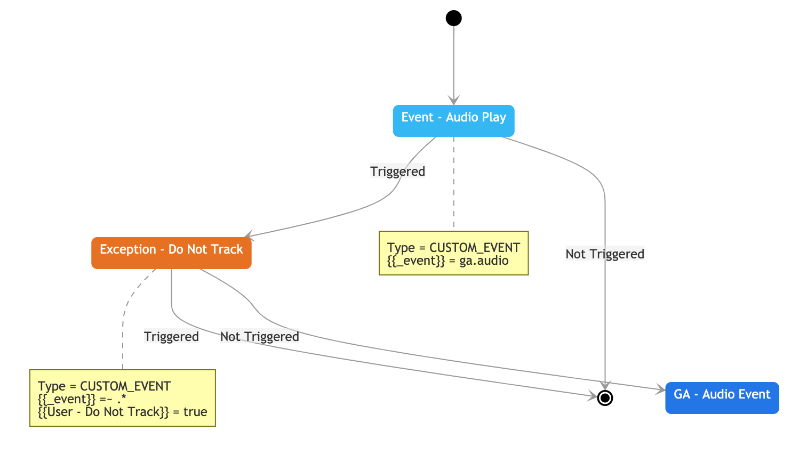
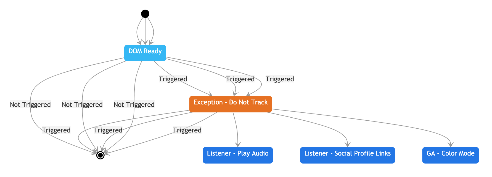

# GTM Flow Chart Generator

This library provides a mechanism for visually representing Google Tag Manager
(GTM) containers as a flow chart, or more accurately a state diagram. This can
be very helpful for more complex GTM containers.

## Usage

1. If you don't have it already on your system, please install nodejs v8+.
2. Install the gtm-flow package.
    ```
    npm install -g @widgetsburritos/gtm-flow
    ```
    _Note: These instructions install the tool globally on your system. If you want
    to limit the scope to a particular project, drop the `-g` flag._
3. Login to Google Tag Manager, go to `Admin -> Container -> Export Container`
4. Click the `Choose a version or workspace` button and then specify the
   desired workspace.
5. Click the `Export` button.
6. Run the following commands to generate reports:
    *Tag report:*
    ```
    gtm-flow --type tag --infile /path/to/GTM-EXPORT-FILE.json --outfile /path/to/desired/location/report.html
    ```

    *Trigger report:*
    ```
    gtm-flow --type trigger --infile /path/to/GTM-EXPORT-FILE.json --outfile /path/to/desired/location/report.html
    ```
7. Open the report file to see the specific report.

   _Note: It may take a little while to load, especially if you have several
   triggers and tags._

## Types of Reports

### Tag Report

Shows the trigger path into a particular tag, including blocking triggers. It provides additional context about the various filters related to each individual trigger.

Example:


### Trigger Report

Shows all tags that respond to a particular trigger, including blocking triggers.

Example:


## Disclaimers

All diagrams are generated using [Mermaid](https://github.com/mermaid-js/mermaid).
It's not a perfect mechanism, and definitely has a few issues where lines
sometimes overlap on top of of one another, or incredibly large graphs become
a bit indecipherable. I've noticed this especially on the trigger reports,
when a trigger points to a large quantity of tags. You mileage may vary.

I've done a few hacky things with CSS here as well, that probably could (and
should) be deferred to mermaid. I just haven't dug enough into that API to see
if it is possible to do at this moment. For the time being, this report does
what I need it to do. Feel free to open pull requests to extend functionality
as you see fit.
